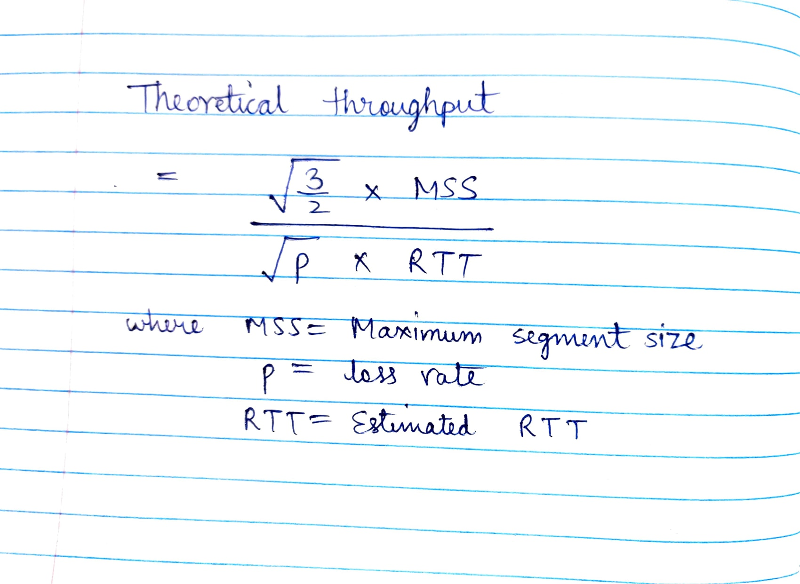

# Part A

sender = `130.245.145.12`
receiver = `128.208.2.198`

The first part (part A) of the assignment deals with parsing the packets captured in the given `assignment2.pcap` file. 

## Approach to parse the packets
To parse the packets, I identified their packet structure in wireshark and observed offset values for various data that I need to capture. Offsets observed were the following:

* TCP Header length offset = 46
* Source IP offset = 26
* Destination IP Offset = 30
* TCP packet starting offset = 34

### Parsing fixed length part

The TCP part is parsed using the TCP packet starting offset. Individual data is parsed by computing their starting offsets (relative to the TCP starting offset) and then extracting the bytes (mostly of fixed length except options part). Then, they are converted to the appropriate data types in python.

### Parsing the options part

To parse the options part, I extracted the tcp header length from the TCP header which denotes the total 32-bit words that need to be present in the header. Since except options, the rest of the header is of fixed length, therefore the difference between the tcp header length and the rest of the fixed length part denoted the number of 32-bit words of the options part. Hence, accordingly it could be extracted successfully.

## Subpart (a)

### Number of flows initiated from sender
Number of flows initiated by sender = 3. 

I counted the number of unique SYN packets sent by the **sender**. The number of unique SYN packets (matching with SYN ACK packets) represented the number of unique connections (or flows) initated by the sender.

### Sequence Number, Ack Number and receive window size

| Flow & Transaction | Sequence Number | Ack Number | Receive window size |
| --- | --- | --- | --- |
| Flow 1 Txn 1 | 705669103 | 1921750144 | 3 |
| Flow 1 Txn 2 | 705669127 | 1921750144 | 3 |
| Flow 2 Txn 1 | 3636173852 | 2335809728 | 3 |
| Flow 2 Txn 2 | 3636173876 | 2335809728 | 3 |
| Flow 3 Txn 1 | 2558634630 | 3429921723 | 3 |
| Flow 3 Txn 2 | 2558634654 | 3429921723 | 3 |

**Explanation:**

* These values are not serial values like 0,1,2, etc but are rather arbitrary values for **security** purposes. 
* The difference between consecutive sequence numbers is 24 which denotes the size of the first transaction sent by the sender. 
* The acknowledgement numbers are the same for the sent transactions since the sender is still expecting the acknowledgement for the first transaction it sent to the receiver. 

## (b) Throughput at the receiver
The throughput at the receiver is computed by accumulating the total bytes (packet size) sent by the receiver to the sender divided by the time difference between the last packet sent and the first packet sent by the receiver.

Throughput = `Sum(packet.size) for every packet` / `Total time elapsed`

Theoretical throughput is computed by using the formula:

| Flow | Throughput | Theoretical Throughput |
| --- | --- | --- |
| Flow 1 | 140665.3786150841 bytes/second | 1012679.6994519229 bytes/second |
| Flow 2 | 38139.8893223247 bytes/second | 209997.114285496 bytes/second |
| Flow 3 | 45150.61762694991 bytes/second | 663027.3446516434 bytes/second |

Comments:

* The difference in throughput is quite significant.
* But throughput values follow the same relationship in both the computed and theoretical versions.

## (c) Loss rate
The loss rate is computed by counting the number of retransmitted packets for every unique sequence number divided by the total number of packets sent. 

For this, firstly I calculate the number of packets sent by the sender. Then, I maintain a mapping of the counts of every sequence number sent by the sender. Let the number of packets sent for a sequence number is N, then the number of retransmitted packets is N-1. I add N-1 for every seq number which totals the number of retransmitted packets and I divide it by the total number of packets sent.

| Flow | Loss rate |
| --- | --- | 
| Flow 1 | 0.0005733123118818977 | 
| Flow 2 | 0.013440860215053764 | 
| Flow 3 | 0.0013717421124828531 | 

## (d) RTT Estimation
To estimate RTT, I considered only those packets those were transmitted only once and ignored all those packets which were retransmitted in RTT estimation (Karn's algorithm). I accomplished this by maintaining the counts of unique sequence numbers sent by the sender. Packets that were sent multiple times (> 1) were ignored in the estimation of RTT.

I calculated the RTT for one packet by subtracting the time difference between the first acknowledgement received and the sent packet's timestamp. I calculate the sum total of all the RTT estimates for every packet and divide by the number of successful transmissions.

| Flow | Estimated RTT |
| --- | --- | 
| Flow 1 | 0.0731385680436392 seconds | 
| Flow 2 | 0.07284291758701494 seconds | 
| Flow 3 | 0.07221817603478065 seconds | 

From the above total, we can observe that thr RTTs are very comparable for all the flows. This is expected since RTT depends on the propagation delay, routing and queuing delays etc and don't depend on the values of a particular TCP Connection.

