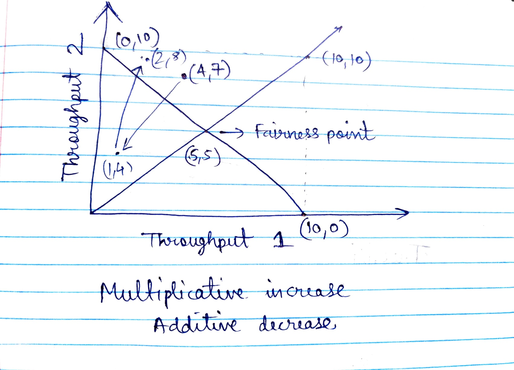
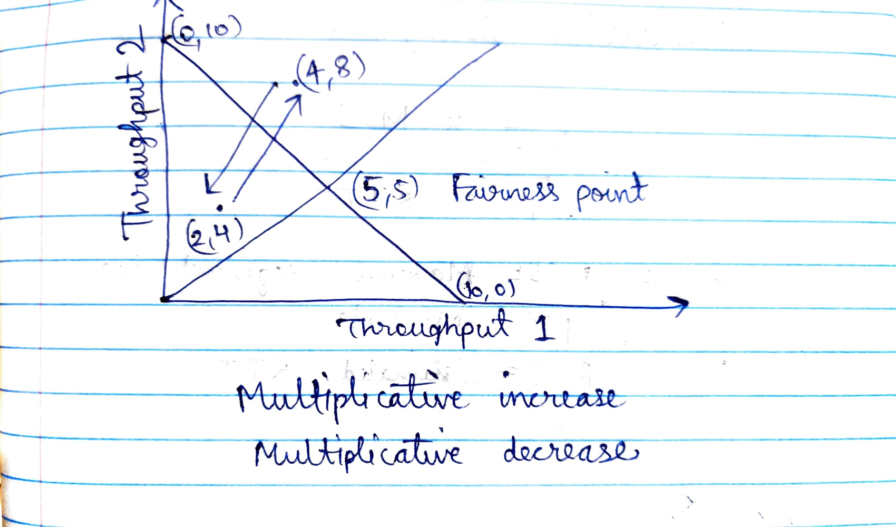
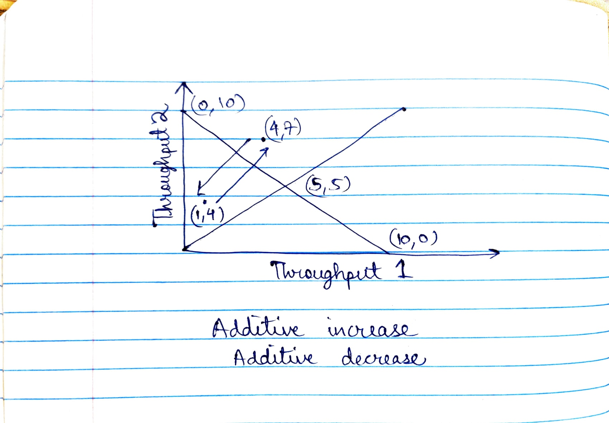

# Part D

## Multiplicative increase additive decrease

From the figure above, we can observe that the throughput diverges away from the fairness point. 

Let the throughput coordinates be (4, 7) at any point in time. Then applying multiplicative increase (x2) and additive decrease (-3), the next point will be (4-3, 7-3) = (1, 4). Now multiplicative increase will happen and the next point will be (2,8). This will keep going on and the throughputs will diverge away from the fairness point.

## Multiplicative increase multiplicative decrease

From the figure above, we can observe that the throughput may always oscillate between 2 values without ever converging to the fairness point.

Let the throughput coordinates at any point in time be (4, 8). Let the multiplicative increase and decrease factor be 2 (same for both). Hence, multiplicative decrease will happen first reducing the coordinates to (2, 4). Then multiplicative increase will happen increasing the coordinates to (4, 8). This will keep oscillating and will never converge to the fairness point.

## Additive increase additive decrease

This is very similar to multiplicative increase and multiplicative decrease.

From the figure above, we can observe that the throughput may always oscillate between 2 values without ever converging to the fairness point.

Let the throughput coordinates at any point in time be (4, 7). Let the additive increase and decrease factor be 3 (same for both). Hence, additive decrease will happen first reducing the coordinates to (1, 4). Then additive increase will happen increasing the coordinates to (4, 7). This will keep oscillating and will never converge to the fairness point.